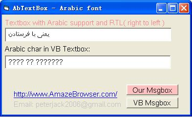

<div align="center">

## AbTextBox


</div>

### Description

Textbox with Arabic support and RTL( right to left )
 
### More Info
 


<span>             |<span>
---                |---
**Submitted On**   |2007-11-08 20:40:02
**By**             |[peter jack](https://github.com/Planet-Source-Code/PSCIndex/blob/master/ByAuthor/peter-jack.md)
**Level**          |Intermediate
**User Rating**    |5.0 (10 globes from 2 users)
**Compatibility**  |VB 6\.0
**Category**       |[Custom Controls/ Forms/  Menus](https://github.com/Planet-Source-Code/PSCIndex/blob/master/ByCategory/custom-controls-forms-menus__1-4.md)
**World**          |[Visual Basic](https://github.com/Planet-Source-Code/PSCIndex/blob/master/ByWorld/visual-basic.md)
**Archive File**   |[AbTextBox2090031182007\.zip](https://github.com/Planet-Source-Code/peter-jack-abtextbox__1-69593/archive/master.zip)

### API Declarations

```
Private Declare Function CreateWindowExW Lib "user32" (ByVal dwExStyle As Long, ByVal lpClassName As Long, ByVal lpWindowName As Long, ByVal dwStyle As Long, ByVal x As Long, ByVal y As Long, ByVal nWidth As Long, ByVal nHeight As Long, ByVal hWndParent As Long, ByVal hMenu As Long, ByVal hInstance As Long, lpParam As Any) As Long
Private Declare Function SetWindowTextW Lib "user32" (ByVal hwnd As Long, ByVal lpString As Long) As Long
Private Declare Function GetWindowTextW Lib "user32" (ByVal hwnd As Long, ByVal lpString As Long, ByVal cch As Long) As Long
Private Declare Function GetWindowTextLengthW Lib "user32" (ByVal hwnd As Long) As Long
Private Declare Function SendMessageW Lib "user32" (ByVal hwnd As Long, ByVal wMsg As Long, ByVal wParam As Long, lParam As Any) As Long
Private hWndEdit As Long
Private m_sText As String
'more and more...
```


